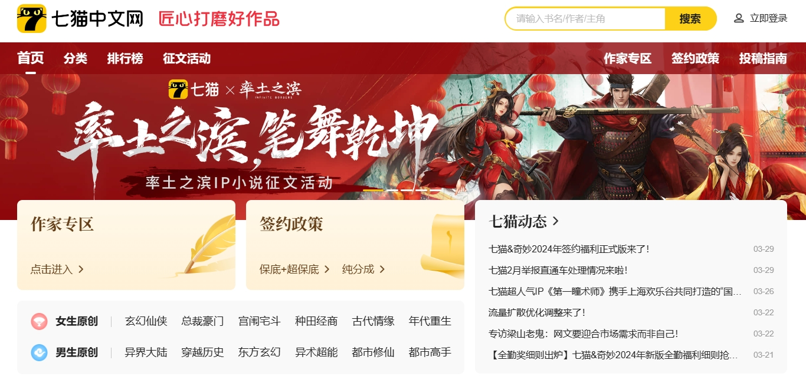

 
 <h2 align="center">七猫中文网</h2>
 
七猫是一家深耕文化娱乐行业的互联网企业，公司总部位于上海市浦东新区海阳西路555号前滩中心25—26楼，在北京、武汉、海南澄迈设有分部，现有员工800余人。公司创始人及核心管理层均来自A股互联网上市公司，企业文化诚实踏实，团队有创业拼搏精神。目前，七猫旗下拥有数字阅读平台“七猫免费小说”，及原创文学平台“七猫中文网”等产品，并积极拓展影视、有声、动漫、出版改编及网文出海等版权衍生业务。

 

	
    
    
    
 

<h2 align="center">贡献者</h2>

<!-- ALL-CONTRIBUTORS-LIST:START - Do not remove or modify this section -->
<!-- prettier-ignore-start -->
<!-- markdownlint-disable -->
<table align="center">
  <tbody>
    <tr>
      <td align="center" valign="top" width="14.28%"><a href="https://github.com/realjayson"> <b>Jayson</b></a> <a href="#maintenance-realjayson" title="Maintenance">🚧</a> <a href="https://github.com/Team3Test/7Cat/commits?author=realjayson" title="Documentation">📖</a> <a href="https://github.com/Team3Test/7Cat/commits?author=realjayson" title="Code">💻</a></td>
      <td align="center" valign="top" width="14.28%"><a href="https://github.com/whuiboy"> <b>whuiboy</b></a> <a href="#maintenance-whuiboy" title="Maintenance">🚧</a> <a href="https://github.com/Team3Test/7Cat/issues?q=author%3Awhuiboy" title="Bug reports">🐛</a> <a href="https://github.com/Team3Test/7Cat/commits?author=whuiboy" title="Code">💻</a></td>
      <td align="center" valign="top" width="14.28%"><a href="https://github.com/citrus73"> <b>citrus</b></a> <a href="#maintenance-citrus73" title="Maintenance">🚧</a> <a href="#question-citrus73" title="Answering Questions">💬</a> <a href="https://github.com/Team3Test/7Cat/commits?author=citrus73" title="Code">💻</a></td>
      <td align="center" valign="top" width="14.28%"><a href="https://github.com/Arpwang"> <b>Arp</b></a> <a href="#maintenance-Arpwang" title="Maintenance">🚧</a> <a href="#design-Arpwang" title="Design">🎨</a> <a href="https://github.com/Team3Test/7Cat/commits?author=Arpwang" title="Code">💻</a></td>
      <td align="center" valign="top" width="14.28%"><a href="https://github.com/Augustyxy"> <b>Augustyxy</b></a> <a href="#maintenance-Augustyxy" title="Maintenance">🚧</a> <a href="#security-Augustyxy" title="Security">🛡️</a> <a href="https://github.com/Team3Test/7Cat/commits?author=Augustyxy" title="Code">💻</a></td>
    </tr>
  </tbody>
</table>

<!-- markdownlint-restore -->
<!-- prettier-ignore-end -->

<!-- ALL-CONTRIBUTORS-LIST:END -->
