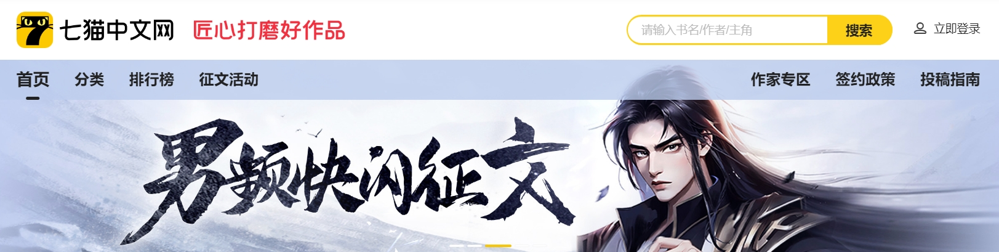

# 7Cat - 七猫中文网
<!-- ALL-CONTRIBUTORS-BADGE:START - Do not remove or modify this section -->

<!-- ALL-CONTRIBUTORS-BADGE:END -->

# 关于七猫

七猫是一家深耕文化娱乐行业的互联网企业，公司总部位于上海市浦东新区海阳西路555号前滩中心25—26楼，在北京、武汉、海南澄迈设有分部，现有员工800余人。公司创始人及核心管理层均来自A股互联网上市公司，企业文化诚实踏实，团队有创业拼搏精神。目前，七猫旗下拥有数字阅读平台“七猫免费小说”，及原创文学平台“七猫中文网”等产品，并积极拓展影视、有声、动漫、出版改编及网文出海等版权衍生业务。

七猫免费小说App于2018年8月正式上线，是七猫旗下拳头产品，上线以来专注为用户提供正版、免费、优质的网络文学内容阅读服务。现七猫免费小说服务用户已超5亿，规模位列数字阅读行业前列。

七猫中文网（原名：梧桐中文网）于2017年5月正式上线，是七猫旗下面向网络文学作者提供创作指导与版权运营等全方位一体化服务的优质内容孵化平台。经过几年积累，已经培养出了一支擅于选题、包装、运营，拥有广泛作者资源与编辑功底的优秀责编团队。七猫中文网已成功举办三届现实题材征文大赛，并在海南三亚、浙江乌镇、上海举办五届作者大会。七猫原创业务正依托自身渠道优势蓬勃发展中，我们力求打造一个符合读者个性化需求的精品内容生产基地。希望携手广大优秀作者，合作共赢，共创具有影响力的原创网络文学品牌。

|               **小组成员**                |
| :---------------------------------------: |
|  [Jayson](https://github.com/realjayson)  |
|   [citrus](https://github.com/citrus73)   |
|   [whuiboy](https://github.com/whuiboy)   |
| [Augustyxy](https://github.com/Augustyxy) |
|     [Arp](https://github.com/Arpwang)     |
|                                           |

## Contributors ✨

Thanks goes to these wonderful people ([emoji key](https://allcontributors.org/docs/en/emoji-key)):

<!-- ALL-CONTRIBUTORS-LIST:START - Do not remove or modify this section -->
<!-- prettier-ignore-start -->
<!-- markdownlint-disable -->
<table>
  <tbody>
    <tr>
      <td align="center" valign="top" width="14.28%"><a href="https://github.com/realjayson"> <b>Jayson</b></a> <a href="#maintenance-realjayson" title="Maintenance">🚧</a> <a href="https://github.com/Team3Test/7Cat/commits?author=realjayson" title="Documentation">📖</a> <a href="https://github.com/Team3Test/7Cat/commits?author=realjayson" title="Code">💻</a></td>
      <td align="center" valign="top" width="14.28%"><a href="https://github.com/whuiboy"> <b>whuiboy</b></a> <a href="#maintenance-whuiboy" title="Maintenance">🚧</a> <a href="https://github.com/Team3Test/7Cat/issues?q=author%3Awhuiboy" title="Bug reports">🐛</a> <a href="https://github.com/Team3Test/7Cat/commits?author=whuiboy" title="Code">💻</a></td>
    </tr>
  </tbody>
</table>

<!-- markdownlint-restore -->
<!-- prettier-ignore-end -->

<!-- ALL-CONTRIBUTORS-LIST:END -->

This project follows the [all-contributors](https://github.com/all-contributors/all-contributors) specification. Contributions of any kind welcome!